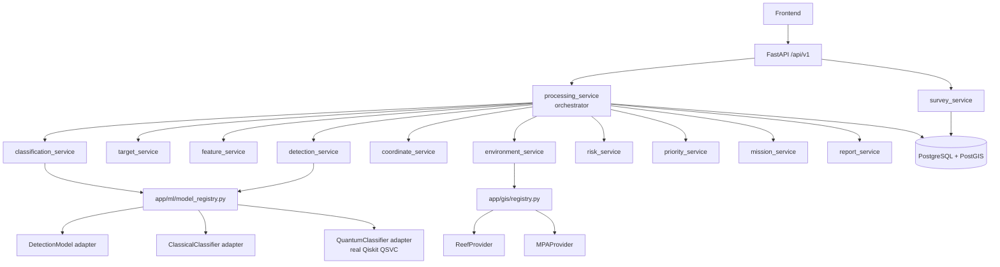

# Architecture

AquaTrace-Q's backend is a modular monolith (FastAPI + SQLAlchemy + PostgreSQL/PostGIS),
not a microservice mesh — deliberately, per the project brief: there's no
demonstrated need for network boundaries between these components yet.



## Why a modular monolith

- One deployable unit, one database connection pool, one set of migrations.
- Every "service boundary" that matters (ML models, QML, GIS datasets) is
  already an adapter interface (`app/ml/`, `app/gis/`) — splitting those
  into separate network services later, if ever justified by load, doesn't
  require restructuring the database or the API.

## The processing pipeline

See `processing-pipeline.md` for the full stage-by-stage breakdown. In short:

```
UPLOAD → VALIDATE → PREPROCESS → DETECT → CREATE TARGETS → EXTRACT FEATURES
  → CLASSICAL CLASSIFY → QUANTUM CLASSIFY → UNCERTAINTY → GEOLOCATE
  → CORAL GIS → MPA GIS → RISK → PRIORITY → MISSION → REPORT
```

Every stage is independently tolerant of its optional inputs being
unavailable (untrained classifier, unconfigured GIS dataset, ungeolocatable
target) — see `docs/processing-pipeline.md` for exactly what each stage
does when that happens.

## Directory layout

```
app/
├── main.py            FastAPI app factory + /health
├── core/               config, logging, exceptions
├── api/v1/              one module per resource; router.py aggregates them
├── schemas/             Pydantic request/response models (the frontend contract)
├── models/               SQLAlchemy ORM models + shared enums
├── services/              business logic — one module per pipeline stage
├── ml/                     DetectionModel / ClassicalClassifier / QuantumClassifier
│                           interfaces + fixture/real implementations + model_registry.py
├── gis/                    ReefProvider / MPAProvider interfaces + GeoJSON implementation
│                           + registry.py
├── parsers/                 SonarParser interface (ImageSonarParser, XTFParser stub)
├── db/                      engine, session, Base (imports every model for Alembic)
└── utils/                    filesystem helpers
```
